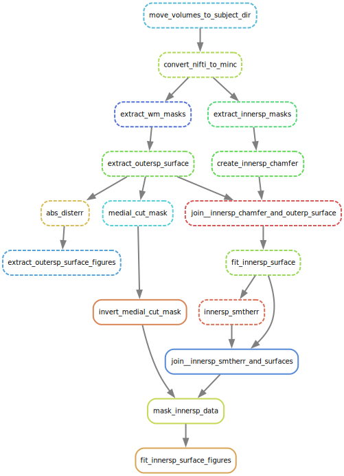

# Fetal Brain MRI Surface Extraction _ChRIS_ Pipeline



## Abstract

This pipeline does preprocessing and QC around
[pl-fetal-cp-surface-extract](https://github.com/FNNDSC/pl-fetal-cp-surface-extract).


## Notes

Create the figure by running

```shell
snakemake --dag extract_outersp_surface_figures fit_innersp_surface_figures | dot -Tsvg > dag.svg
```
